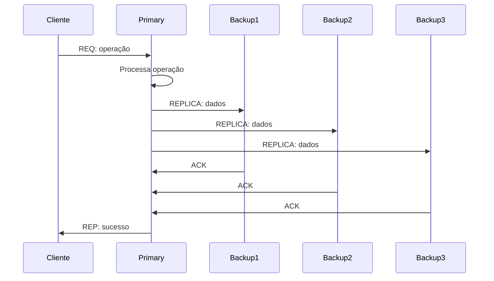

# Sistema de Mensagens Instantâneas Distribuído

Este projeto implementa um sistema completo de mensagens distribuído usando ZeroMQ, seguindo os padrões de sistemas distribuídos estudados na disciplina.

## Arquitetura

### Componentes

- **Broker (Python)**: Proxy ROUTER-DEALER para balanceamento round-robin entre clientes e servidores
- **Proxy (Python)**: Proxy XPUB-XSUB para comunicação Publisher-Subscriber
- **Servidor de Referência (Python)**: Gerencia ranks, heartbeat e lista de servidores ativos
- **Servidores (Node.js)**: 3 réplicas que processam requisições e publicam mensagens
- **Cliente Interativo (Go)**: CLI para usuário real
- **Bots (Go)**: 2 réplicas de clientes automáticos gerando mensagens

### Linguagens Utilizadas

- **Python**: Broker, Proxy, Servidor de Referência
- **JavaScript/Node.js**: Servidores (múltiplas réplicas)
- **Go**: Clientes (interativo e bots)

## Funcionalidades Implementadas

### Parte 1: Request-Reply
- Login de usuários (sem senha)
- Listagem de usuários cadastrados
- Criação e listagem de canais
- Persistência em arquivos JSON

### Parte 2: Publisher-Subscriber
- Publicação de mensagens em canais
- Mensagens privadas entre usuários
- Bot automático gerando mensagens
- Persistência de mensagens e publicações

### Parte 3: MessagePack
- Serialização binária para todas as mensagens
- Redução do tamanho das mensagens
- Compatibilidade entre diferentes linguagens

### Parte 4: Relógios e Sincronização
- Relógio lógico em todos os processos
- Servidor de referência para gerenciamento de ranks
- Sincronização Berkeley entre servidores
- Heartbeat para monitoramento de servidores

### Parte 5: Consistência e Replicação

## Método de Replicação: Primary-Backup Passivo

### Descrição do Método

Implementamos o método de **Replicação Passiva (Primary-Backup)** para garantir que todos os servidores mantenham uma cópia completa dos dados. Este método foi escolhido por sua simplicidade e eficácia para o contexto do projeto.

### Características da Implementação

1. **Identificação do Primary**: O servidor com menor rank (determinado pelo servidor de referência) assume o papel de coordenador/primary
2. **Replicação Síncrona**: Todas as operações de escrita são replicadas para os backups antes de confirmar ao cliente
3. **Consistência Forte**: Garante que todos os servidores tenham dados idênticos
4. **Recuperação Automática**: Em caso de falha do primary, um novo primary é eleito automaticamente

### Processo de Replicação



### Troca de Mensagens para Replicação

#### Requisição de Replicação (Primary → Backup)
```json
{
  "service": "replicate_login|replicate_channel|replicate_publish|replicate_message",
  "data": {
    "timestamp": 1234567890,
    "clock": 42,
    // ... campos específicos da operação
  }
}
```

#### Resposta de Replicação (Backup → Primary)
```json
{
  "service": "replicate_login|replicate_channel|replicate_publish|replicate_message",
  "data": {
    "status": "OK",
    "timestamp": 1234567890,
    "clock": 43
  }
}
```

### Tratamento de Falhas

1. **Falha do Primary**: 
   - Servidor de referência detecta falta de heartbeat
   - Novo primary é eleito (servidor com menor rank disponível)
   - Sistema continua funcionando com novo primary

2. **Falha de Backup**:
   - Primary detecta falha na replicação
   - Remove backup da lista de servidores ativos
   - Continua operação com backups restantes

3. **Recuperação de Servidor**:
   - Servidor volta a enviar heartbeat
   - Recebe novo rank do servidor de referência
   - Sincroniza dados com primary atual

### Modificações no Método Padrão

1. **Comunicação via ZeroMQ**: Utilizamos sockets REQ/REP para comunicação entre servidores
2. **Relógio Lógico**: Integração com relógios lógicos para ordenação de eventos
3. **Heartbeat Integrado**: Monitoramento através do servidor de referência existente
4. **Eleição Automática**: Novo primary é determinado pelo menor rank disponível

## Como Executar

### Pré-requisitos
- Docker e Docker Compose
- Portas 5555-5562 disponíveis

### Execução
```bash
cd src
docker-compose up --build
```

### Testando o Sistema

1. **Cliente Interativo**: Conecte ao container `client` e use os comandos:
   - `login <nome>` - Fazer login
   - `users` - Listar usuários
   - `channels` - Listar canais
   - `create <canal>` - Criar canal
   - `pub <canal> <mensagem>` - Publicar no canal
   - `msg <usuário> <mensagem>` - Enviar mensagem privada

2. **Bots Automáticos**: Os bots começam automaticamente a gerar mensagens

3. **Monitoramento**: Verifique os logs dos containers para acompanhar:
   - Sincronização de relógios
   - Processo de replicação
   - Heartbeat dos servidores

### Teste de Falhas

1. **Derrubar Primary**: `docker stop <container_primary>`
2. **Verificar Eleição**: Logs mostrarão novo primary sendo eleito
3. **Testar Continuidade**: Sistema deve continuar funcionando normalmente

## Estrutura de Arquivos

```
src/
├── broker/           # Broker Python (ROUTER-DEALER)
├── proxy/            # Proxy Python (XPUB-XSUB)
├── reference/        # Servidor de Referência Python
├── server/           # Servidores Node.js (3 réplicas)
├── client/           # Cliente Go (interativo e bot)
├── docker-compose.yml
├── Dockerfile.python
├── Dockerfile.node
└── Dockerfile.go
```

## Persistência

Todos os dados são persistidos em arquivos JSON:
- `users.json` - Usuários cadastrados
- `channels.json` - Canais criados
- `messages.json` - Mensagens privadas
- `publications.json` - Publicações em canais

## Formato de Mensagens

Todas as mensagens seguem o padrão MessagePack:
```json
{
  "service": "nome_servico",
  "data": {
    "timestamp": 1234567890,
    "clock": 42,
    // ... campos específicos
  }
}
```
